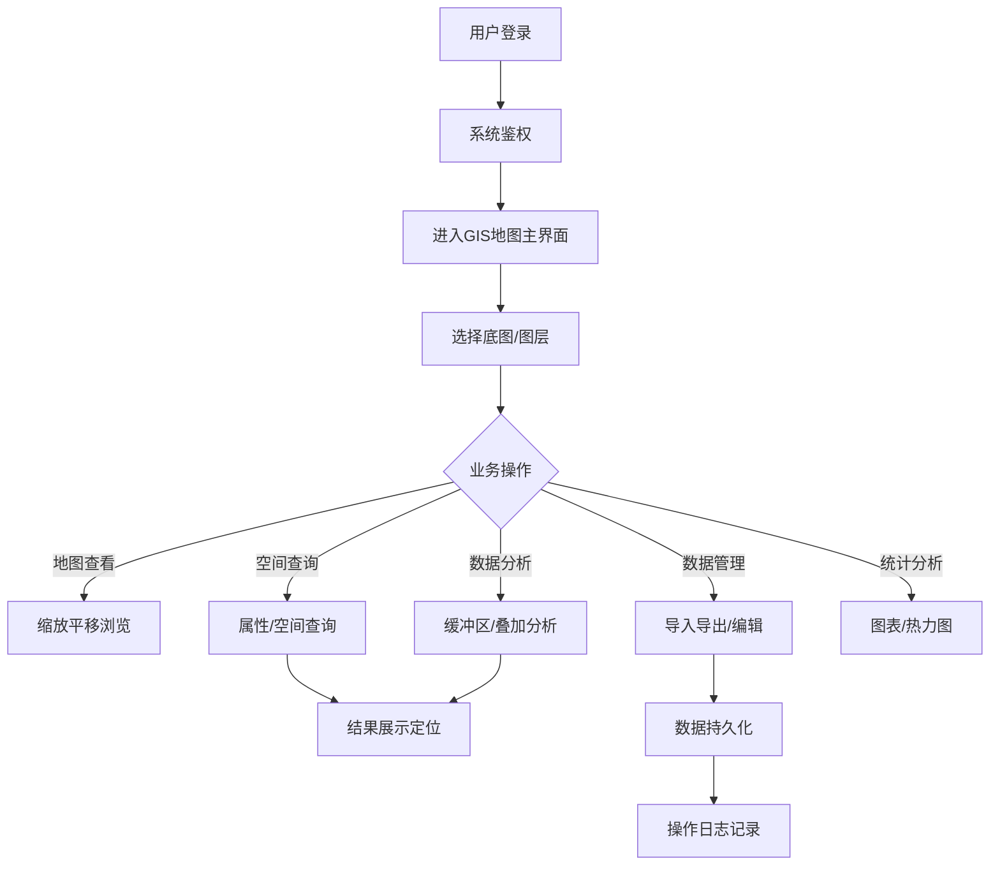

# GIS地理信息系统 - 产品需求文档

## 1. 产品概述

本产品为轻量化、高性能、可扩展的Web GIS地理信息系统，支撑国土巡查、资源管理、城市运维、场景可视化等业务场景，实现地理数据与业务数据的深度融合。

**核心价值**：标准化存储、可视化展示、智能化分析、业务化应用的地理空间信息管理平台

**目标用户**：国土巡查人员、资源管理人员、城市运维人员、数据分析人员、系统管理员

## 2. 核心功能模块

### 2.1 用户角色

| 角色 | 说明 | 核心权限 |
|------|------|----------|
| 系统管理员 | 系统全面管理 | 用户管理、角色管理、权限配置、数据管理、系统配置 |
| 运维人员 | 系统运维监控 | 地图管理、数据编辑、日志查看、服务监控 |
| 业务人员 | 业务数据操作 | 地图查看、空间查询、数据统计、基础数据维护 |

### 2.2 功能模块

1. **地图基础功能模块**
   - 地图初始化与底图切换
   - 图层管理（新增/隐藏/删除/置顶/置底）
   - WMS/WFS图层接入
   - 比例尺、鹰眼图、坐标拾取
   - 地图打印与截图导出

2. **空间查询与分析模块**
   - 属性查询（名称、类型、编号等）
   - 空间查询（点选、框选、圈选、多边形选择）
   - 距离/面积测量
   - 缓冲区分析
   - 叠加分析

3. **空间数据管理模块**
   - SHP/GeoJSON数据批量导入导出
   - 要素在线编辑（新增/修改/删除）
   - 数据校验与质量控制
   - 历史数据归档与版本管理

4. **统计可视化模块**
   - 要素数量统计（按类型、区域、状态）
   - 图表可视化（柱状图、饼图、折线图）
   - 热力图展示
   - 图表联动地图定位

5. **系统权限管理模块**
   - 用户管理（CRUD、权限分配）
   - 角色管理（自定义角色、权限绑定）
   - 菜单权限控制
   - 数据权限控制

6. **日志监控模块**
   - 登录日志
   - 操作日志
   - 异常日志

## 3. 核心业务流程

## 4. 页面结构

| 页面名称 | 功能描述 | 核心模块 |
|---------|---------|---------|
| 登录页面 | 用户身份认证 | 账号密码登录、Token令牌管理 |
| GIS地图主页面 | 系统核心入口 | 地图容器、工具栏、图层面板 |
| 空间查询页面 | 空间数据检索 | 查询条件、结果列表、地图联动 |
| 数据管理页面 | 地理数据管理 | 数据导入、导出、编辑、校验 |
| 统计分析页面 | 数据可视化 | 统计图表、热力图、报表 |
| 用户管理页面 | 权限系统 | 用户CRUD、角色配置 |
| 角色管理页面 | 角色权限 | 角色CRUD、权限分配 |
| 系统设置页面 | 系统配置 | 日志查看、监控配置 |

## 5. 用户界面设计

### 5.1 设计风格

- **整体风格**：科技感、专业化的地理信息平台风格，深色系主色调突出地图显示
- **配色方案**：
  - 主色：`#1a56db`（科技蓝）
  - 辅色：`#111827`（深灰黑）
  - 强调色：`#10b981`（成功绿）、`#f59e0b`（警告黄）、`#ef4444`（错误红）
  - 背景色：`#0f172a`（深色背景）、`#1e293b`（卡片背景）
- **布局风格**：左侧固定导航 + 右侧地图主区域 + 顶部工具栏 + 底部状态栏
- **字体**：思源黑体（中文）、Roboto（英文），清晰的层级大小

### 5.2 核心页面UI元素

| 页面 | 主要UI元素 | 交互特性 |
|------|-----------|---------|
| 登录页 | 居中卡片、Logo、输入框、登录按钮 | 表单验证、登录状态提示 |
| 地图主页 | 地图容器、工具栏、鹰眼图、比例尺 | 鼠标滚轮缩放、拖拽平移、右键菜单 |
| 图层面板 | 树形图层列表、可见性切换、透明度滑块 | 拖拽排序、批量操作 |
| 查询面板 | 条件输入框、查询按钮、结果表格 | 分页查询、结果高亮、地图定位 |
| 数据编辑 | 要素表单、坐标编辑、几何绘制工具 | 实时验证、坐标同步 |
| 统计图表 | 图表容器、筛选条件、数据筛选器 | 图表联动、动态刷新 |

### 5.3 响应式策略

- **桌面端优先**（1280px+）：完整功能展示，左侧导航收起/展开
- **平板适配**（768px-1279px）：导航折叠为图标，工具栏精简
- **移动端**（<768px）：简化版查看模式，核心地图浏览功能

## 6. 非功能性需求

### 6.1 性能指标

- 地图初始加载时间：≤2秒
- 千级要素渲染：流畅无卡顿
- 空间查询响应：≤500ms
- 接口请求超时：≤10秒

### 6.2 数据精度要求

- 空间坐标精度：≤0.0001°
- 面积计算误差：<1%
- 距离测量误差：<0.1%

### 6.3 安全要求

- 所有接口需JWT认证
- 敏感数据加密传输
- 操作日志完整记录
- 数据定期备份机制

### 6.4 兼容性要求

- Chrome、Edge、Firefox、Safari最新版
- Windows、macOS、Linux系统
- 分辨率1280×720及以上
