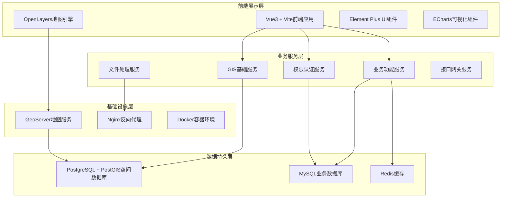
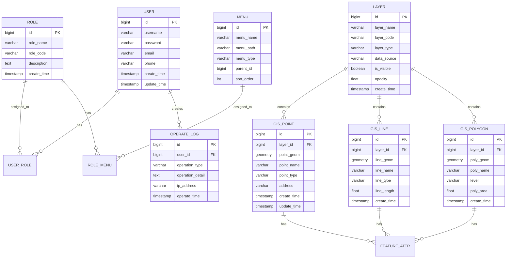
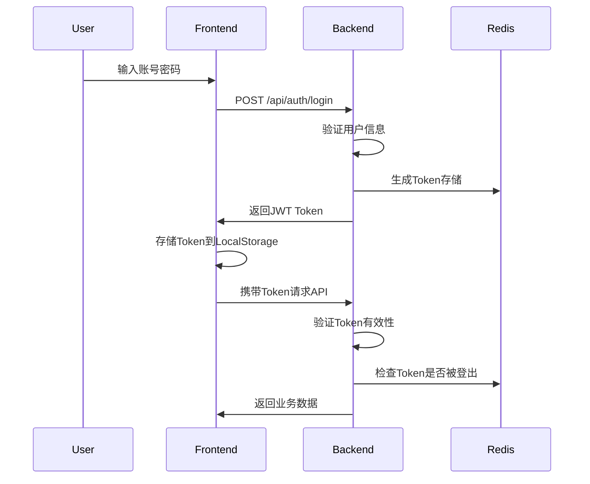

# GIS地理信息系统 - 技术架构文档

## 1. 架构设计

### 1.1 系统架构分层



### 1.2 技术选型说明

| 层级 | 技术选型 | 版本 | 说明 |
|------|---------|------|------|
| 前端框架 | Vue3 | 3.4+ | 组合式API、TypeScript支持 |
| 前端构建 | Vite | 5.0+ | 快速热更新、ESM构建 |
| GIS引擎 | OpenLayers | 9.0+ | 开源二维地图引擎 |
| UI组件库 | Element Plus | 2.5+ | Vue3组件库 |
| 可视化图表 | ECharts | 5.4+ | 空间数据统计图表 |
| 后端框架 | SpringBoot | 2.7.x | 微服务架构可选 |
| 空间数据库 | PostgreSQL | 12+ | 专业空间数据库 |
| 空间扩展 | PostGIS | 3.0+ | 空间索引与分析 |
| 地图服务 | GeoServer | 2.18+ | WMS/WFS服务发布 |
| 权限认证 | Spring Security + JWT | - | 接口安全认证 |
| 缓存中间件 | Redis | 6.0+ | 高频数据缓存 |
| 反向代理 | Nginx | 1.20+ | 静态资源与跨域 |

## 2. 技术栈详细说明

### 2.1 前端技术栈

**核心框架**

- **Vue3**：采用Composition API + TypeScript，提供更好的类型检查和代码组织
- **Vite**：基于ESM的开发服务器，冷启动快速，热更新即时
- **Vue Router**：官方路由管理，支持路由守卫和懒加载
- **Pinia**：轻量级状态管理，比Vuex更现代简洁

**GIS相关**

- **OpenLayers**：开源WebGIS地图引擎，支持多种地图格式和空间分析
- **Proj4js**：坐标系转换库，支持GCJ-02、EPSG:4326、EPSG:3857
- **Turf.js**：JavaScript空间分析库，客户端缓冲区、叠加分析

**UI与可视化**

- **Element Plus**：企业级Vue3组件库，提供表单、表格、弹窗等
- **ECharts**：百度开源图表库，支持GIS数据统计可视化
- **TailwindCSS**：原子化CSS框架，快速构建响应式界面

### 2.2 后端技术栈

**核心框架**

- **SpringBoot 2.7.x**：简化Spring应用开发，内嵌Tomcat服务器
- **Spring Security**：安全框架，JWT令牌认证
- **MyBatis-Plus**：增强ORM，简化数据库操作

**GIS服务**

- **GeoServer**：开源地图服务器，发布WMS/WFS标准服务
- **GeoTools**：Java空间数据处理库，SHP文件解析

**数据存储**

- **PostgreSQL + PostGIS**：存储空间矢量数据、影像瓦片
- **MySQL 8.0**：存储业务数据、用户数据、系统配置
- **Redis**：缓存高频访问数据、会话管理

## 3. 路由定义

### 3.1 前端路由表

| 路由路径 | 页面名称 | 权限要求 | 功能描述 |
|---------|---------|---------|---------|
| /login | 登录页面 | 公开 | 用户登录认证 |
| / | 首页重定向 | 已登录 | 自动跳转地图主页 |
| /map | GIS地图主页 | 用户 | 地图展示、工具栏、图层管理 |
| /map/query | 空间查询页面 | 用户 | 属性查询、空间查询 |
| /map/analysis | 空间分析页面 | 用户 | 缓冲区分析、叠加分析 |
| /data/manage | 数据管理页面 | 运维 | 数据导入导出、要素编辑 |
| /data/import | 数据导入页面 | 运维 | SHP/GeoJSON导入 |
| /stats | 统计分析页面 | 用户 | 图表统计、热力图 |
| /system/user | 用户管理页面 | 管理员 | 用户CRUD |
| /system/role | 角色管理页面 | 管理员 | 角色权限配置 |
| /system/log | 日志监控页面 | 管理员 | 操作日志查看 |

## 4. 接口定义

### 4.1 接口规范

```typescript
// 统一请求头
interface RequestHeaders {
  'Content-Type': 'application/json';
  'Authorization': 'Bearer {jwt_token}';
}

// 统一响应格式
interface ApiResponse<T = any> {
  code: number;      // 状态码
  message: string;   // 提示信息
  data: T;           // 数据体
  timestamp: number; // 时间戳
}
```

### 4.2 核心接口清单

**图层管理接口**

| 接口路径 | 请求方式 | 参数 | 返回值 | 说明 |
|---------|---------|------|--------|------|
| /api/gis/layer/list | GET | - | LayerInfo[] | 获取图层列表 |
| /api/gis/layer/{id} | GET | id | LayerDetail | 获取图层详情 |
| /api/gis/layer | POST | LayerCreateDTO | LayerInfo | 创建图层 |
| /api/gis/layer/{id} | PUT | LayerUpdateDTO | LayerInfo | 更新图层 |
| /api/gis/layer/{id} | DELETE | id | - | 删除图层 |

**空间要素接口**

| 接口路径 | 请求方式 | 参数 | 返回值 | 说明 |
|---------|---------|------|--------|------|
| /api/gis/feature/query | POST | FeatureQueryDTO | FeaturePageResult | 空间要素查询 |
| /api/gis/feature/{id} | GET | id | FeatureDetail | 获取要素详情 |
| /api/gis/feature | POST | FeatureCreateDTO | FeatureInfo | 新增要素 |
| /api/gis/feature | PUT | FeatureUpdateDTO | FeatureInfo | 更新要素 |
| /api/gis/feature/{id} | DELETE | id | - | 删除要素 |

**空间分析接口**

| 接口路径 | 请求方式 | 参数 | 返回值 | 说明 |
|---------|---------|------|--------|------|
| /api/gis/analysis/buffer | POST | BufferDTO | BufferResult | 缓冲区分析 |
| /api/gis/analysis/overlay | POST | OverlayDTO | OverlayResult | 叠加分析 |
| /api/gis/analysis/measure | POST | MeasureDTO | MeasureResult | 距离面积测量 |

**数据管理接口**

| 接口路径 | 请求方式 | 参数 | 返回值 | 说明 |
|---------|---------|------|--------|------|
| /api/gis/data/import | POST | FormData | ImportResult | 数据导入 |
| /api/gis/data/export | POST | ExportDTO | File | 数据导出 |
| /api/gis/data/validate | POST | DataDTO | ValidateResult | 数据校验 |

**统计分析接口**

| 接口路径 | 请求方式 | 参数 | 返回值 | 说明 |
|---------|---------|------|--------|------|
| /api/gis/stats/count | GET | type, region | CountResult | 数量统计 |
| /api/gis/stats/heatmap | GET | layerId | HeatmapData | 热力图数据 |

**权限管理接口**

| 接口路径 | 请求方式 | 参数 | 返回值 | 说明 |
|---------|---------|------|--------|------|
| /api/system/user/list | GET | page, size | UserPageResult | 用户列表 |
| /api/system/user | POST | UserCreateDTO | UserInfo | 创建用户 |
| /api/system/user/{id} | PUT | UserUpdateDTO | UserInfo | 更新用户 |
| /api/system/user/{id} | DELETE | id | - | 删除用户 |
| /api/system/role/list | GET | - | RoleInfo[] | 角色列表 |
| /api/system/role | POST | RoleCreateDTO | RoleInfo | 创建角色 |

### 4.3 数据传输对象

```typescript
// 空间要素查询DTO
interface FeatureQueryDTO {
  layerId: string;
  geometry?: GeoJSON.Geometry;      // 空间范围
  bounds?: [number, number, number, number]; // 边界框
  attributes?: Record<string, any>; // 属性条件
  page?: number;
  pageSize?: number;
}

// 缓冲区分析DTO
interface BufferDTO {
  geometry: GeoJSON.Geometry;
  distance: number;               // 缓冲距离（米）
  unit: 'm' | 'km';
  targetLayers: string[];          // 分析目标图层
}

// 要素创建DTO
interface FeatureCreateDTO {
  layerId: string;
  geometry: GeoJSON.Geometry;
  properties: Record<string, any>;
}

// 用户创建DTO
interface UserCreateDTO {
  username: string;
  password: string;
  email: string;
  phone?: string;
  roleIds: string[];
  dataScopes?: string[];
}
```

## 5. 数据模型

### 5.1 数据模型ER图



### 5.2 数据定义语言

**用户表（sys_user）**

```sql
CREATE TABLE sys_user (
    id BIGINT PRIMARY KEY AUTO_INCREMENT,
    username VARCHAR(50) NOT NULL UNIQUE,
    password VARCHAR(255) NOT NULL,
    email VARCHAR(100),
    phone VARCHAR(20),
    status TINYINT DEFAULT 1 COMMENT '0禁用 1启用',
    create_time TIMESTAMP DEFAULT CURRENT_TIMESTAMP,
    update_time TIMESTAMP DEFAULT CURRENT_TIMESTAMP ON UPDATE CURRENT_TIMESTAMP,
    INDEX idx_username (username),
    INDEX idx_status (status)
) ENGINE=InnoDB DEFAULT CHARSET=utf8mb4 COMMENT='系统用户表';
```

**角色表（sys_role）**

```sql
CREATE TABLE sys_role (
    id BIGINT PRIMARY KEY AUTO_INCREMENT,
    role_name VARCHAR(50) NOT NULL,
    role_code VARCHAR(50) NOT NULL UNIQUE,
    description TEXT,
    create_time TIMESTAMP DEFAULT CURRENT_TIMESTAMP,
    INDEX idx_role_code (role_code)
) ENGINE=InnoDB DEFAULT CHARSET=utf8mb4 COMMENT='系统角色表';
```

**图层表（gis_layer）**

```sql
CREATE TABLE gis_layer (
    id BIGINT PRIMARY KEY AUTO_INCREMENT,
    layer_name VARCHAR(100) NOT NULL,
    layer_code VARCHAR(50) NOT NULL UNIQUE,
    layer_type VARCHAR(20) NOT NULL COMMENT 'point/line/polygon/raster',
    data_source VARCHAR(255) COMMENT 'WMS地址或数据存储路径',
    srs VARCHAR(20) DEFAULT 'EPSG:4326' COMMENT '坐标系',
    is_visible BOOLEAN DEFAULT TRUE,
    opacity FLOAT DEFAULT 1.0,
    sort_order INT DEFAULT 0,
    create_time TIMESTAMP DEFAULT CURRENT_TIMESTAMP,
    update_time TIMESTAMP DEFAULT CURRENT_TIMESTAMP ON UPDATE CURRENT_TIMESTAMP,
    INDEX idx_layer_code (layer_code),
    INDEX idx_layer_type (layer_type)
) ENGINE=InnoDB DEFAULT CHARSET=utf8mb4 COMMENT='地图图层表';
```

**点要素表（gis_point）**

```sql
CREATE TABLE gis_point (
    id BIGINT PRIMARY KEY AUTO_INCREMENT,
    layer_id BIGINT NOT NULL,
    point_name VARCHAR(100),
    point_type VARCHAR(50),
    address VARCHAR(200),
    point_geom GEOMETRY(POINT, 4326) NOT NULL,
    properties JSON COMMENT '扩展属性',
    create_time TIMESTAMP DEFAULT CURRENT_TIMESTAMP,
    update_time TIMESTAMP DEFAULT CURRENT_TIMESTAMP ON UPDATE CURRENT_TIMESTAMP,
    SPATIAL INDEX idx_point_geom (point_geom),
    INDEX idx_layer_id (layer_id),
    INDEX idx_point_type (point_type),
    FOREIGN KEY (layer_id) REFERENCES gis_layer(id) ON DELETE CASCADE
) ENGINE=InnoDB DEFAULT CHARSET=utf8mb4 COMMENT='点要素空间数据表';
```

**线要素表（gis_line）**

```sql
CREATE TABLE gis_line (
    id BIGINT PRIMARY KEY AUTO_INCREMENT,
    layer_id BIGINT NOT NULL,
    line_name VARCHAR(100),
    line_type VARCHAR(50),
    line_length FLOAT COMMENT '长度自动计算',
    line_geom GEOMETRY(LINESTRING, 4326) NOT NULL,
    properties JSON,
    create_time TIMESTAMP DEFAULT CURRENT_TIMESTAMP,
    update_time TIMESTAMP DEFAULT CURRENT_TIMESTAMP ON UPDATE CURRENT_TIMESTAMP,
    SPATIAL INDEX idx_line_geom (line_geom),
    INDEX idx_layer_id (layer_id),
    FOREIGN KEY (layer_id) REFERENCES gis_layer(id) ON DELETE CASCADE
) ENGINE=InnoDB DEFAULT CHARSET=utf8mb4 COMMENT='线要素空间数据表';
```

**面要素表（gis_polygon）**

```sql
CREATE TABLE gis_polygon (
    id BIGINT PRIMARY KEY AUTO_INCREMENT,
    layer_id BIGINT NOT NULL,
    poly_name VARCHAR(100),
    level VARCHAR(50),
    poly_area FLOAT COMMENT '面积自动计算',
    poly_geom GEOMETRY(POLYGON, 4326) NOT NULL,
    properties JSON,
    create_time TIMESTAMP DEFAULT CURRENT_TIMESTAMP,
    update_time TIMESTAMP DEFAULT CURRENT_TIMESTAMP ON UPDATE CURRENT_TIMESTAMP,
    SPATIAL INDEX idx_poly_geom (poly_geom),
    INDEX idx_layer_id (layer_id),
    FOREIGN KEY (layer_id) REFERENCES gis_layer(id) ON DELETE CASCADE
) ENGINE=InnoDB DEFAULT CHARSET=utf8mb4 COMMENT='面要素空间数据表';
```

**操作日志表（sys_operate_log）**

```sql
CREATE TABLE sys_operate_log (
    id BIGINT PRIMARY KEY AUTO_INCREMENT,
    user_id BIGINT,
    username VARCHAR(50),
    operation_type VARCHAR(50) COMMENT '登录/新增/修改/删除/导入/导出',
    operation_module VARCHAR(50),
    operation_detail TEXT,
    ip_address VARCHAR(50),
    user_agent VARCHAR(255),
    operate_time TIMESTAMP DEFAULT CURRENT_TIMESTAMP,
    INDEX idx_user_id (user_id),
    INDEX idx_operate_time (operate_time),
    INDEX idx_operation_type (operation_type)
) ENGINE=InnoDB DEFAULT CHARSET=utf8mb4 COMMENT='操作日志表';
```

### 5.3 空间索引配置

```sql
-- 为空间数据表创建GiST空间索引
CREATE INDEX idx_gis_point_geom_gist ON gis_point USING GIST (point_geom);
CREATE INDEX idx_gis_line_geom_gist ON gis_line USING GIST (line_geom);
CREATE INDEX idx_gis_polygon_geom_gist ON gis_polygon USING GIST (poly_geom);

-- 启用自动统计信息收集
ALTER TABLE gis_point ALTER COLUMN point_geom SET STATISTICS 500;
ALTER TABLE gis_line ALTER COLUMN line_geom SET STATISTICS 500;
ALTER TABLE gis_polygon ALTER COLUMN poly_geom SET STATISTICS 500;

-- 定期维护空间索引
VACUUM ANALYZE gis_point;
VACUUM ANALYZE gis_line;
VACUUM ANALYZE gis_polygon;
```

## 6. 项目目录结构

```
gis-system/
├── frontend/                    # 前端项目
│   ├── src/
│   │   ├── assets/            # 静态资源
│   │   │   ├── images/         # 图片资源
│   │   │   └── styles/        # 全局样式
│   │   ├── components/        # 公共组件
│   │   │   ├── common/        # 通用组件
│   │   │   ├── map/           # 地图组件
│   │   │   └── charts/        # 图表组件
│   │   ├── composables/       # 组合式函数
│   │   ├── layouts/           # 布局组件
│   │   ├── pages/             # 页面视图
│   │   │   ├── map/           # 地图相关页面
│   │   │   ├── data/          # 数据管理页面
│   │   │   ├── stats/         # 统计页面
│   │   │   └── system/        # 系统管理页面
│   │   ├── router/            # 路由配置
│   │   ├── stores/            # 状态管理
│   │   ├── types/             # TypeScript类型定义
│   │   ├── utils/             # 工具函数
│   │   ├── api/               # API接口调用
│   │   ├── App.vue
│   │   └── main.ts
│   ├── public/
│   ├── index.html
│   ├── vite.config.ts
│   ├── tsconfig.json
│   └── package.json
│
├── backend/                    # 后端项目
│   ├── src/
│   │   ├── main/
│   │   │   ├── java/com/gis/
│   │   │   │   ├── controller/    # 控制器层
│   │   │   │   ├── service/      # 服务层
│   │   │   │   ├── mapper/       # 数据访问层
│   │   │   │   ├── entity/       # 实体类
│   │   │   │   ├── dto/          # 数据传输对象
│   │   │   │   ├── config/       # 配置类
│   │   │   │   ├── security/     # 安全认证
│   │   │   │   └── gis/          # GIS专用处理
│   │   │   └── resources/
│   │   │       ├── mapper/       # MyBatis映射文件
│   │   │       └── application.yml
│   │   └── test/
│   ├── pom.xml
│   └── docker/
│
├── geoserver/                  # GeoServer配置
│   └── workspaces/
│
├── database/                   # 数据库脚本
│   ├── init.sql               # 初始化脚本
│   └── migrations/           # 增量脚本
│
├── docker-compose.yml         # 容器编排
├── nginx.conf                 # Nginx配置
└── README.md                  # 项目说明
```

## 7. 部署架构

### 7.1 Docker容器部署

```yaml
# docker-compose.yml
version: '3.8'

services:
  frontend:
    image: nginx:alpine
    ports:
      - "80:80"
    volumes:
      - ./frontend/dist:/usr/share/nginx/html
      - ./nginx.conf:/etc/nginx/nginx.conf
    depends_on:
      - backend

  backend:
    image: openjdk:17-slim
    ports:
      - "8080:8080"
    environment:
      - SPRING_PROFILES_ACTIVE=prod
      - POSTGRES_HOST=postgres
      - REDIS_HOST=redis
    volumes:
      - ./backend:/app
    depends_on:
      - postgres
      - redis
      - geoserver

  geoserver:
    image: kartoza/geoserver:2.18
    ports:
      - "8081:8080"
    volumes:
      - ./geoserver/data:/opt/geoserver/data

  postgres:
    image: postgis/postgis:12-3.0
    ports:
      - "5432:5432"
    environment:
      - POSTGRES_DB=gis_db
      - POSTGRES_USER=postgres
      - POSTGRES_PASSWORD=postgres123
    volumes:
      - postgres_data:/var/lib/postgresql/data
      - ./database/init.sql:/docker-entrypoint-initdb.d/init.sql

  redis:
    image: redis:6-alpine
    ports:
      - "6379:6379"
    volumes:
      - redis_data:/data

volumes:
  postgres_data:
  redis_data:
```

### 7.2 Nginx配置

```nginx
server {
    listen 80;
    server_name localhost;
    
    root /usr/share/nginx/html;
    index index.html;

    # 前端静态资源
    location / {
        try_files $uri $uri/ /index.html;
    }

    # API代理
    location /api/ {
        proxy_pass http://backend:8080/api/;
        proxy_set_header Host $host;
        proxy_set_header X-Real-IP $remote_addr;
    }

    # GeoServer代理
    location /geoserver/ {
        proxy_pass http://geoserver:8080/geoserver/;
        proxy_set_header Host $host;
    }

    # 静态资源缓存
    location ~* \.(js|css|png|jpg|jpeg|gif|ico|svg|woff|woff2|ttf|eot)$ {
        expires 1y;
        add_header Cache-Control "public, immutable";
    }
}
```

## 8. 安全设计

### 8.1 JWT认证流程



### 8.2 接口安全策略

- 所有接口需携带有效JWT Token
- Token有效期：访问令牌1小时，刷新令牌7天
- 敏感操作需二次验证
- 接口调用频率限制
- SQL注入、XSS攻击防护
- CORS跨域配置
- 请求参数校验

## 9. 性能优化策略

### 9.1 前端优化

- 路由懒加载减少首屏加载时间
- 图层按需加载避免一次性加载过多
- 要素分页加载控制渲染数量
- 图片、瓦片资源缓存
- WebGL加速地图渲染
- 防抖节流优化交互响应

### 9.2 后端优化

- 空间索引优化查询性能
- 数据库连接池配置
- Redis缓存高频数据
- 异步处理批量导入导出
- 分页查询避免全表扫描
- 定时任务清理过期数据

### 9.3 数据库优化

```sql
-- 空间查询优化示例
SELECT * FROM gis_point 
WHERE ST_Contains(
    ST_GeomFromText('POLYGON((...))', 4326),
    point_geom
)
AND point_type = 'facility';

-- 创建空间索引
CREATE INDEX idx_point_spatial ON gis_point USING GIST (point_geom);

-- 属性索引优化
CREATE INDEX idx_point_type ON gis_point (point_type);
```

## 10. 监控与日志

### 10.1 日志规范

```yaml
# 日志配置
logging:
  level:
    root: INFO
    com.gis: DEBUG
  pattern:
    console: "%d{yyyy-MM-dd HH:mm:ss} [%thread] %-5level %logger{36} - %msg%n"
  file:
    name: logs/gis-system.log
    max-size: 100MB
    max-history: 30
```

### 10.2 监控指标

- 系统健康检查接口
- 接口响应时间统计
- 数据库连接池状态
- 空间查询性能监控
- 用户在线统计
- 错误日志告警
